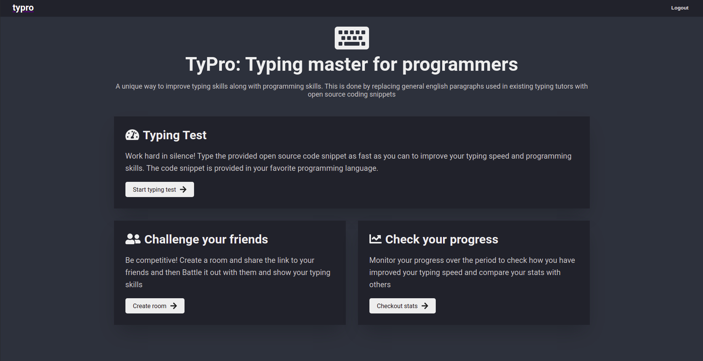

<h1 align="center">
	TyPro
</h1>

<h3 align="center">
  Type racer for programmers
</h3>

  

  

  <a href="#-about-the-project">About the project</a>&nbsp;&nbsp;&nbsp;|&nbsp;&nbsp;&nbsp;
  <a href="#-features">Features</a>&nbsp;&nbsp;&nbsp;|&nbsp;&nbsp;&nbsp;
  <a href="#-getting-started">Getting started</a>&nbsp;&nbsp;&nbsp;|&nbsp;&nbsp;&nbsp;
  <a href="#-built-with">Built with</a>&nbsp;&nbsp;&nbsp;|&nbsp;&nbsp;&nbsp;
  <a href="#-acknowledgements">Acknowledgements</a>&nbsp;&nbsp;&nbsp;|&nbsp;&nbsp;&nbsp;

## 👨🏻‍💻 About The Project

TyPro provides a unique way to improve typing skills along with programming skills. It replaces general English paragraphs and poems used in existing typing tutors with open source code snippets. This will help end-users to improve their typing speeds, especially while programming.

## 🌟 Features

- Code snippets instead of paragraphs
- Support for Multiple Programming Languages
- Provides graphical stats so the user can monitor his progress over the period
- Multiplayer mode where friends can compete with each other
- Guest Login if you don't want to share your credentials

## 🚀 Built With

1. React
2. MongoDB
3. Express
4. Node.js

## Developers

- [Rohit Chaudhari](https://github.com/chaudharirohit2810)
- [Roshan Bangar](https://github.com/Roshan23699)
- [Aditya Abhang](https://github.com/Adi190920)
